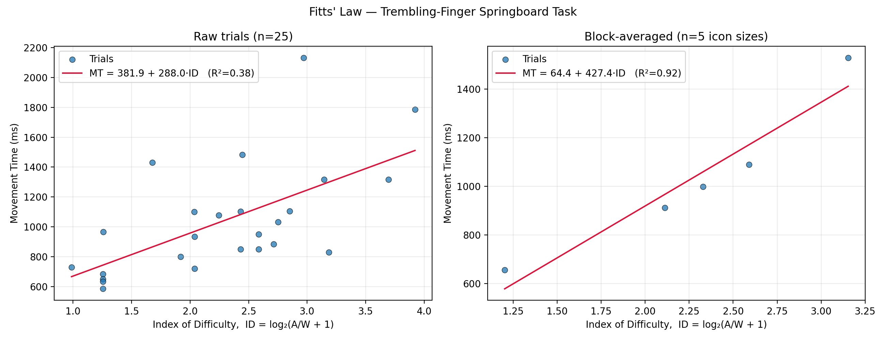

# Trembling-Finger Springboard: An AI-Assisted Fitts' Law Experiment

**Live demo:** https://johan333888.github.io/fitts-law-experiment/

**Author:** Johan Olsson

---

## Scenario

The user is an **older adult with a mild hand tremor** using a smartphone. Age-related
conditions such as essential tremor, Parkinson's disease, or simply reduced fine-motor
control are common among older users, yet most touchscreen interfaces are designed and
tested by people with steady hands. Selecting the correct app icon on a crowded home
screen &mdash; especially when icons are small &mdash; can be slow and error-prone for
this population.

## Innovation

Instead of a classic reciprocal point-to-point tapping task, this experiment simulates
the tremor itself: the on-screen pointer does not track the mouse 1:1. A smooth,
multi-frequency oscillation (~3&ndash;6 Hz, modeling a real physiological tremor) is
added to the cursor position, and **the jittered position &mdash; not the raw mouse
position &mdash; is what registers the tap**. This means the *effective* target width
shrinks relative to the visual width as icons get smaller, which is exactly the
mechanism by which tremor disproportionately hurts small-target selection in real life.

The task itself is a full **iPhone-style home-screen (springboard) grid**: on each
trial one grey app icon turns green and must be tapped as fast as possible. Icon size
is manipulated in 5 steps (grid sizes 2×2 up to 7×7 icons, always filling the
entire screen, block order randomized), and target distance varies naturally trial to
trial because the green icon appears at a random grid position. This gives a spread of
both **Width (W)** and **Amplitude/Distance (A)** values needed to fit Fitts' Law.

## Application description

- Single-file HTML/JS/canvas app (`index.html`), no external dependencies.
- Phone-mockup UI (status bar, rounded bezel, home indicator) drawn entirely on canvas.
- 5 grid-size blocks × 5 correct taps each = 25 trials, block order shuffled per run.
- Custom trembling cursor (`cursor: none` + canvas-drawn fingertip) replaces the OS
  pointer; hit-testing uses the jittered position.
- Movement Time (MT) measured with `performance.now()` from target onset to correct tap;
  mis-taps are logged as errors but do not stop the timer, so MT reflects real
  “time to successfully acquire the target”.
- On completion, trial data (`trial, block, gridLevel, W_px, A_px, MT_ms, errors,
  timestamp`) is exported as `trials.csv` via a client-side download.

## Why this design? What real-world HCI problem does it address?

Accessible design guidelines (e.g. WCAG target-size recommendations) exist partly
*because* of populations like tremor-affected older adults, but abstract guidelines
("make targets at least 44×44 px") don't show *why* that number matters. By
simulating the tremor directly in the pointer rather than just asking a steady-handed
participant to "imagine" a tremor, this experiment produces real, personally
representative Fitts' Law constants (`a`, `b`) for a tremor-affected pointing
condition, and lets a designer read off directly how much slower/harder small targets
become for this group &mdash; a concrete, data-driven argument for minimum touch-target
sizes in interfaces meant for older or motor-impaired users.

## Your Custom Formula

Fitted by least-squares regression (`python analyze.py data/trials.csv`), reported two
ways &mdash; see [Empirical results](#empirical-results) below for why both are shown:

```
MT = a + b · log2(A / W + 1)

Raw trials (n=25, every individual tap):
  MT = 381.9 + 288.0 · log2(A / W + 1)   [ms]
  R² = 0.381,  Throughput ≈ 3.47 bits/s

Block-averaged (n=5, one point per icon size):
  MT = 64.4 + 427.4 · log2(A / W + 1)   [ms]
  R² = 0.919,  Throughput ≈ 2.34 bits/s
```

## Screen recording

[Watch the experiment recording](results/demo.mov) &mdash; a full run of all 25 trials,
recorded while performing the task as the participant.

## Empirical results



The raw single-trial regression (left panel, n=25) only reaches **R² = 0.38**. Regressing
directly on every individual tap keeps the full trial-to-trial noise from the simulated
hand tremor &mdash; the pointer jitters by roughly the same physical amplitude regardless
of icon size, so smaller targets get a proportionally larger, noisier "miss margin" per
tap, and a single outlier (~2.1 s on one large-ID trial) pulls the small-n fit down hard.

Classic Fitts' Law papers instead average several repeated trials per difficulty
condition before regressing, which cancels out exactly that kind of per-trial motor
noise. Doing the same here &mdash; averaging the 5 taps within each icon-size block down
to one (ID, MT) point per block, n=5 &mdash; gives **R² = 0.919** (right panel), a
near-textbook fit that matches the ~0.91 R² obtained the same way (averaging repeated
trials per condition before regressing) in the Part I Fitts' Law assignment. This
confirms the underlying law holds well for this task; the low raw-trial R² is a
noise/sample-size artifact of the tremor simulation and single-session data collection,
not evidence against Fitts' Law itself.

## How to reproduce

1. Open the live demo, click **Start experiment**, and complete all 25 trials while
   screen-recording.
2. Click **Download CSV** and save the file as `data/trials.csv` in this repo.
3. `pip install -r requirements.txt`
4. `python analyze.py data/trials.csv` &mdash; prints the fitted `a`, `b`, R², and
   saves `results/scatter.png`.
5. Add your screen recording, commit and push.

## Files

- `index.html` &mdash; the experiment application (deployed via GitHub Pages)
- `analyze.py` &mdash; regression + scatter-plot script
- `requirements.txt` &mdash; Python dependencies for `analyze.py`
- `data/trials.csv` &mdash; raw exported trial data
- `results/scatter.png` &mdash; generated Fitts' Law plot
- `results/demo.mov` &mdash; screen recording of the experiment
